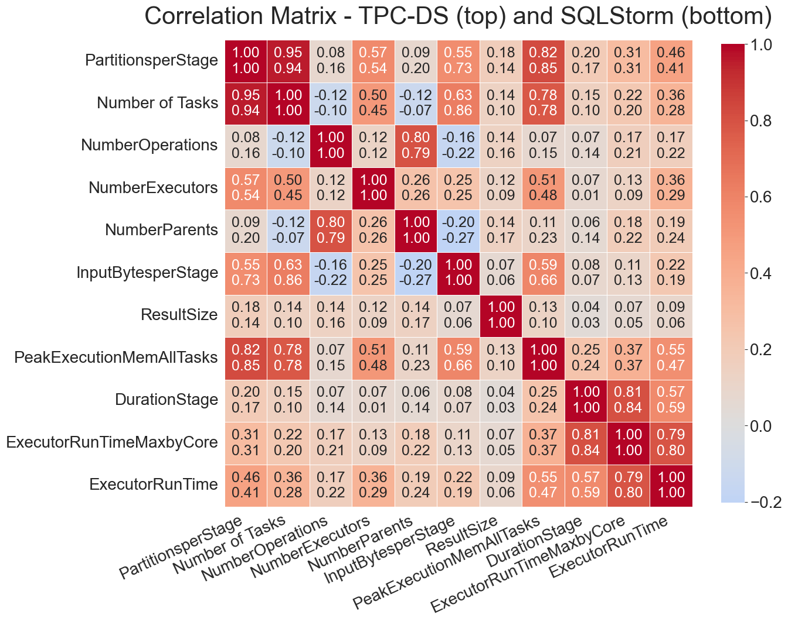
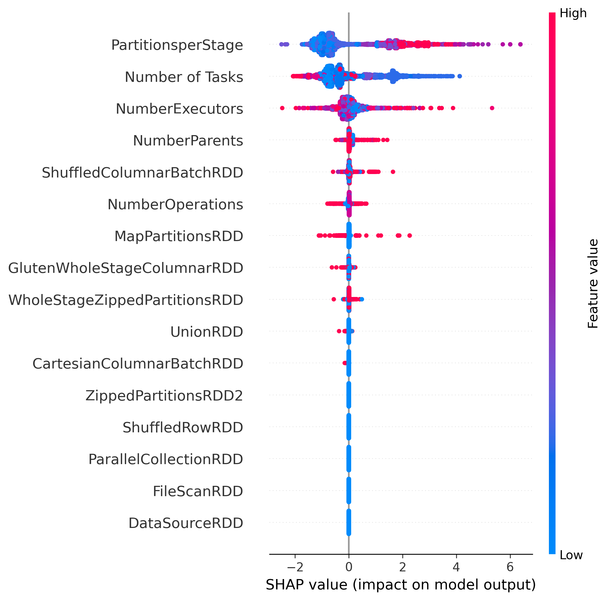
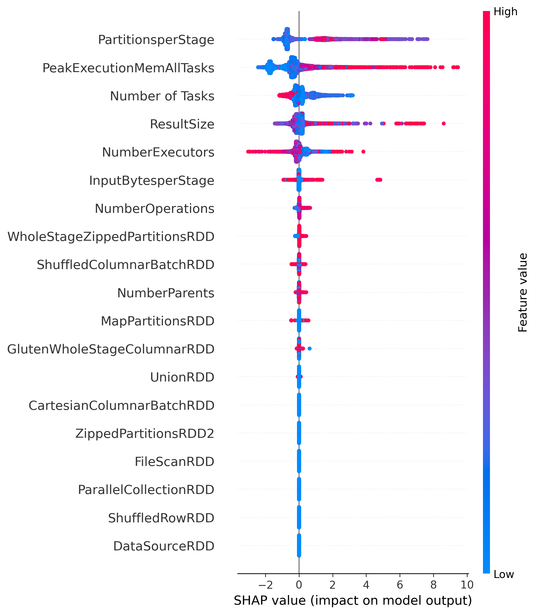
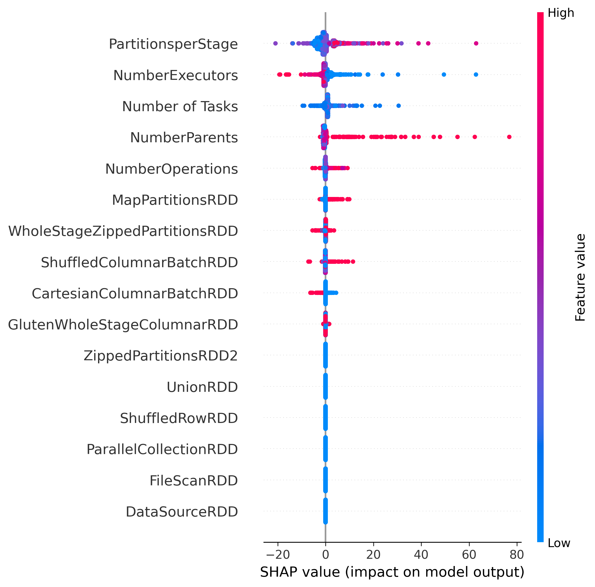
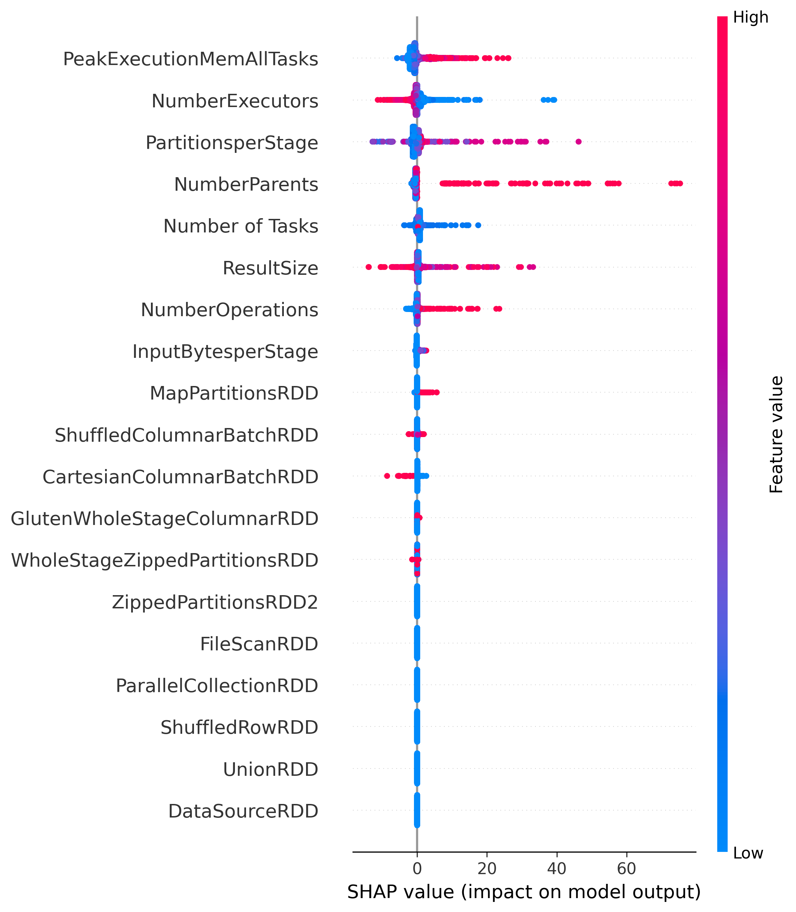
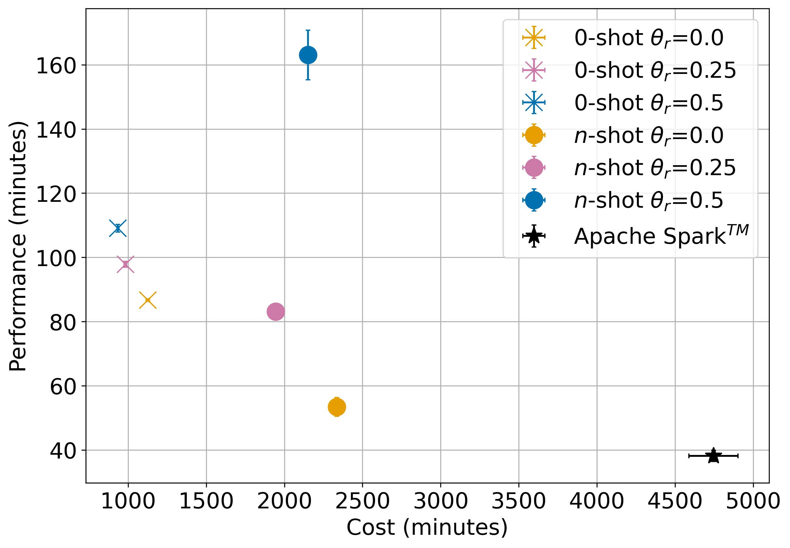
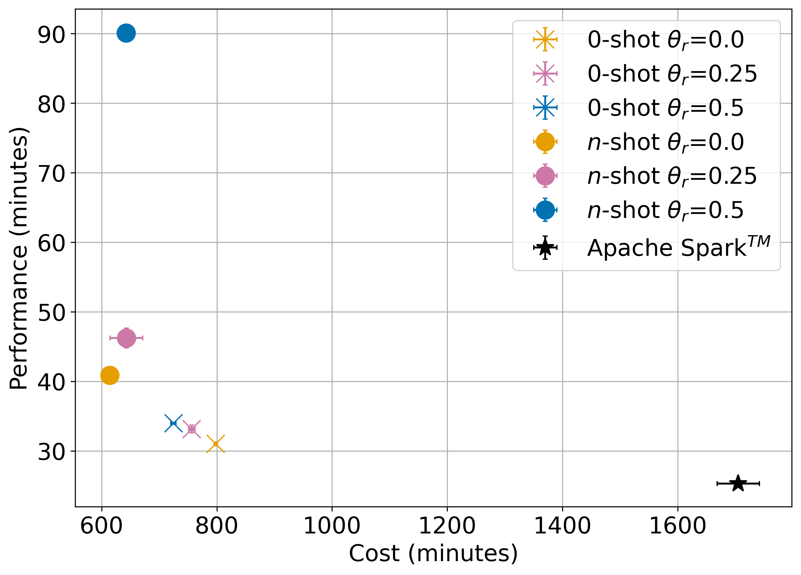
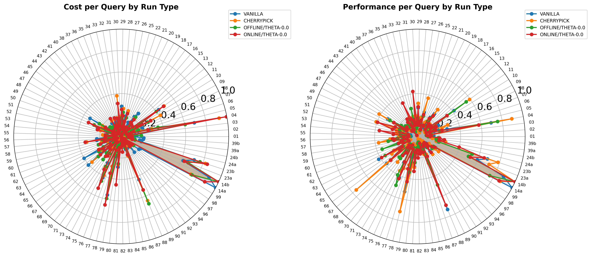
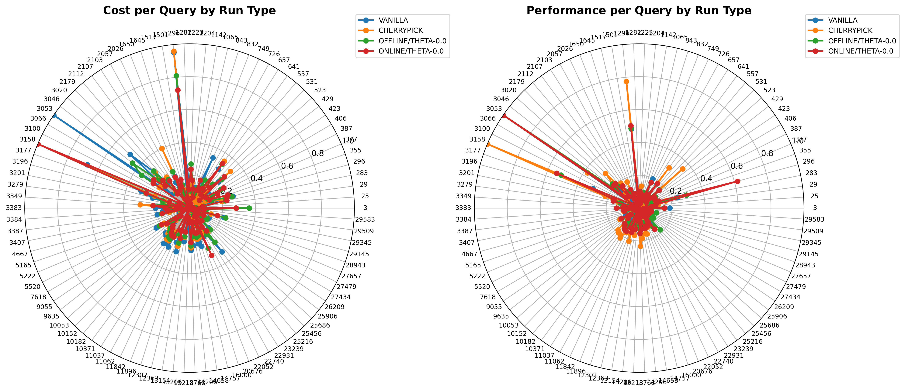
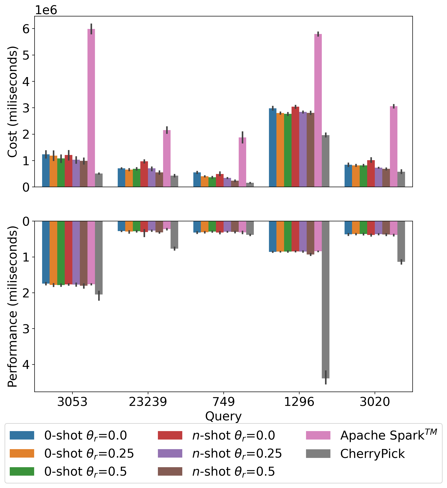

# Appendix C: Extended Results

## Appendix C.1 Correlation Matrix

Correlation matrix for relevant features of both benchmarks.

---

## Appendix C.2 SHAP Plots Our Models

SHAP plots for our cost prediction models for both benchmarks.

### C.2.1 TPC-DS 

#### 0-shot model

#### n-shot model

### C.2.2 SQLStorm

#### 0-shot model

#### n-shot model

## C.3 Target analyses

Additional results of end-to-end testing Scenario $\gamma$ using models that predict DurationStage.  

### C.3.1 TPC-DS 
 

### C.3.1 SQLStorm
 

## Appendix C.4 Extended Per Query Results

Additional results on the per query analyses in both benchmarks.

### C.4.1 TPC-DS 

Radar plots showing Cost and Performance across all queries.

The following table shows the top-5 queries with the largest divergence in cost from $0-shot$ and Apache Spark approach for TPC-DS.

| Query   |  Cost $0-shot$ | Cost Apache Spark |   Cost Difference |
|---------|---------------|-----------------|-------------------|
| 14b     |     7,209,175 |      16,333,383 |         9,124,208 |
| 03      |       528,223 |       9,253,531 |         8,725,308 |
| 14a     |     6,705,714 |      14,700,672 |         7,994,958 |
| 23b     |     5,357,945 |       9,911,296 |         4,553,351 |
| 04      |     6,476,707 |      10,448,988 |         3,972,281 |

## C.4.2 SQLStorm 

Radar plots showing Cost and Performance across all queries.

The following table shows the top-5 queries with the largest divergence in cost from $0-shot$ and Apache Spark approach for SQLStorm.

| Query | Cost $0-shot$ | Cost Apache Spark | Cost Difference |
|-------|-------------|-------------|-----------------|
| 3053  | 1,416,380   | 5,810,624   | 4,394,244       |
| 1296  | 3,088,394   | 5,723,702   | 2,635,308       |
| 3020  | 910,406     | 3,111,072   | 2,200,666       |
| 23239 | 694,750     | 2,267,374   | 1,572,624       |
| 749   | 561,207     | 1,674,908   | 1,113,701       |

Furthermore we show cost and performance across all approches in the top-5 queries for SQLStorm:

 

## C.5 Data Resources

The files `data/performance_cost_values_tcpds_baselines_offline_online_duration_final.csv` and `data/performance_cost_values_tcpds_baselines_offline_online_maxbycore_final.csv` contain aggregated statistical summaries of performance and cost metrics for the TPC-DS benchmark comparing different strategies. Columns provide mean and standard deviation values for both Performance (Perf. mean, Perf. std) and Cost (Cost mean, Cost std) metrics across multiple query executions. The dataset includes six optimization strategies: $0-shot$ approaches with varying theta parameters ($\theta_r=0.0$, 0.25, and 0.5), three $n-shot$ approaches with corresponding theta settings ($\theta_r=0.0$, 0.25, and 0.5), and the Apache Spark baseline for comparison.

The file `data/performance_stormsql_maxbycore_per_query.csv` contains performance and cost metrics for the StormSQL benchmark across multiple proposed methods and baseline strategies. Each record includes four key metrics: Performance (Perf.), Cost, both in miliseconds, Query identifier, and method (optimization strategy). The dataset encompasses multiple run methods including ONLINE/THETA-0.0, ONLINE/THETA-0.25, ONLINE/THETA-0.5, OFFLINE/THETA-0.0, OFFLINE/THETA-0.25, OFFLINE/THETA-0.5, VANILLA baseline, and CHERRY-PICK strategies. Where ONLINE = $0-shot$ approach, OFFLINE = $n-shot$ approach, VANILLA = Apache Spark run. The data represents multiple executions per query (indicated by repeated Query IDs with varying Perf. and Cost values), allowing for analysis of performance variability and consistency across different  approaches. Similarly `data/performance_tpcds_maxbycore_per_query.csv` contains same metrics for TPC-DS.

